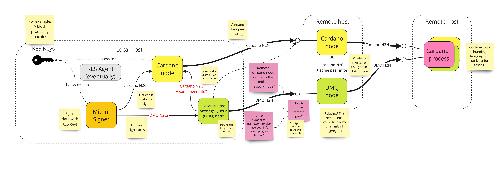

# Archive

Driving forces that led to a demand for wider knowledge share through blueprints.

- [Alternatives](./alternatives.md)

## Interface first
- Conformance tests
- CIPs?
- Open standards / avoid not invented here / off-the-shelf especially close to the user
  - Node-to-client niche way to implement an API
  - Many components built by the community to work around the limitations
  - Would have happened anyways, but maybe some could have been avoided?
  - Example: ogmios, was started out of frustration about unusability of n2c, now [de-facto standard](https://ogmios.dev/faq/#are-there-any-projectscompanies-using-it) sidecar to a cardano-node
    - many workarounds of arcane / hard-to use n2c quirks 
    - transaction submission / backward compatibility of transactions
    - fee estimation
    - test vectors
  - Missing documentation requires many projects to fill in the gaps and even reverse-engineer the haskell code, e.g. https://arsmagna.xyz/docs/network-lsq/
  - mention utxo-grpc?

<!--
Which is a shame, because there is even a need for variants _within_ the Cardano network. For example: making the cardano ledger state available to other applications, so-called "indexers". The tricky thing with this is that there exists as many opinions in how that data should be made available as there are use cases and developers out there. Some prefer a `PostgreSQL` database ([DBSync](https://github.com/IntersectMBO/cardano-db-sync), [karp](https://github.com/dcSpark/carp)), while others fancy more light-weight `SQLite` ([kupo](https://github.com/CardanoSolutions/kupo)), or programmable filters ([scrolls](https://github.com/txpipe/scrolls)). (There are even more indexers and variants cropping up by the day)

With the `cardano-node` being architected (or at least communicated through this [prominent diagram](https://docs.cardano.org/about-cardano/explore-more/cardano-architecture/)) as that opaque, impenetratable component, the only option these ...

While there have been many indexers for all kinds of `DBSync` in particular is ..
-->

## Is Haskell a deterrent?

- Current teams / components are not a "bad cut" per se
- Without external contributions, tight (process) coupling ensues
- Feature teams concerning about one aspect across components?

- Competing implementations was already tried in the past
  - Rust vs. Haskell -> Jormungandr vs. cardano-node
  
- In-language re-use vs. language-agnostic re-use
  - foreign function interfaces
  - process boundaries
  - WebAssembly based frameworks ([hermes](https://github.com/input-output-hk/hermes))

## Case study: mithril

- Evolution from userspace to kernel space
- How can experiments and new ideas transcend into "the node" eventually?
- Mithril completely separate -> Mithril side-car / network re-use -> Signer part of node -> Use signed data in node (for consensus)
- Modular decentralized message queue (DMQ) node architecture we built

## Why substrate?
- Why were partner chains and midnight have been resorting to use substrate?
- How is substrate doing it (people seem to like to use their framework)? https://substrate.io/
- In the past: Advertised as a framework where polkadot node is _just one_ way of combining components (pellets)
- However, just recently substrate moved even now more _into_ a definite Polkadot SDK?
  - Making it less a re-usable framework and already less appealling now?
